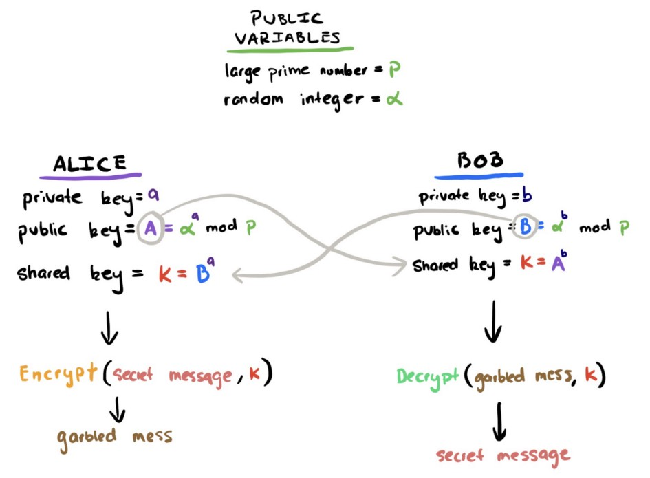

This is to be completed as a solo assignment.

For your first lab assignment, you will be creating a GitHub User Page about yourself for your GitHub account. The purpose is to give an introduction of who you are as a programmer, who you are as a person, and any other interesting things you'd like to share with the kind of person who might be taking a look at your profile (think potential employers, open source devs, generally just the kinds of people who would be looking at the source code for a project you made).

### Part 1. Installing Visual Studio Code and Extensions

We'll be supporting VSCode as the main IDE for this class. One of the strengths of VSCode is the ecosystem of extensions that helps increase your efficiency as a developer and allows you to customize the experience of your IDE.

1. Download and install VSCode here: [https://code.visualstudio.com/download](https://code.visualstudio.com/download)

2. Install VSCode extensions.

   Here are a few suggestions that may be useful for this course:

   - [Draw.io](https://marketplace.visualstudio.com/items?itemName=hediet.vscode-drawio)
   - [LiveShare](https://marketplace.visualstudio.com/items?itemName=MS-vsliveshare.vsliveshare)
   - [Markdown All In One](https://marketplace.visualstudio.com/items?itemName=yzhang.markdown-all-in-one)
   - [CodeStream](https://marketplace.visualstudio.com/items?itemName=CodeStream.codestream)

Also feel free to explore and install any other extension that suits your needs and optimize your experience!

### Part 2. (Re)Familiarizing Ourselves with Git

Throughout the project, you will use git to access and modify your repository on GitHub. To ensure everyone has a working knowledge of git, you will use it to modify your repository using both the command prompt and the VS Code source control UI.

First, create the GitHub repository for your GitHub Pages project. Make sure the repository is public and includes a "README.md" file.

#### Command Line

For the following steps, perform each step using the command line unless otherwise stated. If anyone is fuzzy on git commands and their uses, [this is a great resource](http://guides.beanstalkapp.com/version-control/common-git-commands.html) describing common commands.

1. **clone** the repository onto your local machine using the command line. For an explanation of how to do this, see [GitHub's documentation](https://docs.github.com/en/free-pro-team@latest/github/creating-cloning-and-archiving-repositories/cloning-a-repository#cloning-an-empty-repository).
2. **cd** into the repo folder and create a new git **branch** called "add-read-me" (can be done either locally or through GitHub) and `checkout` that branch into your local repository.
3. Add the text "*Your name*'s User Page" to the "README.md" file. This can be done using a separate text editor.
4. **add** the new file to git.
5. **commit** the files with the commit message "Update readme file".
6. **push** the commit to the remote branch.

Take a screenshot of these commands being performed as a deliverable.

#### VSCode UI

Secondly, we will go through a similar process in VS Code, as you may find it easier to use its built-in version control UI. For an overview of how to use VS Code version control, consult the [documentation](https://code.visualstudio.com/docs/editor/versioncontrol#_git-support).

Open the repository in VS Code, create a new branch, switch to it, and make another change to the README file - adding a line about your favorite programming language.

#### .gitignore

After adding a README file, create a file titled PRIVATE.txt. In this file, place your name and PID. Once this is done, create a **.gitignore** file in the root of your repository and add the path to this PRIVATE.txt file (just the name of the file if PRIVATE.txt is in the root).

Under the `Source Control` tab, stage the change to the file and add an appropriate commit message.

Before committing and pushing the change, take a screenshot of the staged commit, commit message, and current branch as a deliverable.

### Part 3. Using Markdown

Create a new file called **index.md**. This is where you'll create your User Page, which should include content that introduces who you are as a programmer and as a person. Your User Page must be made with Markdown as described in the [GitHub User Page introduction above](https://guides.github.com/features/pages/#setup). For this assignment, your page must include the following:

- Pictures

- Links

- All other core Markdown constructs in

  GitHub Flavored Markdown

  - The core constructs being Headings, Styling text, Quoting text, Quoting code, Links, Section links, Relative links, Lists, and Task lists

Once you are finished, **publish your web page** through Github Pages - [instructions here](https://docs.github.com/en/github/working-with-github-pages/configuring-a-publishing-source-for-your-github-pages-site). Include the URL to the published site in your README.md file.

 

OPTIONAL:

If you find yourself wanting to go above and beyond, here are some things you can add:

- A GitHub Pages theme
- Custom domain name for this page 

 

### Submit to Canvas:

- Link to your GitHub Repository. Inside your repo, make sure you have:
  - A folder called screenshots in your root directory with
    - Screenshot of command line git transactions
    - Screenshot of staged commit in VS Code
  - **.gitignore**
  - A **README** file with the URL of your published GitHub pages site
  - Any other files you created for this assignment